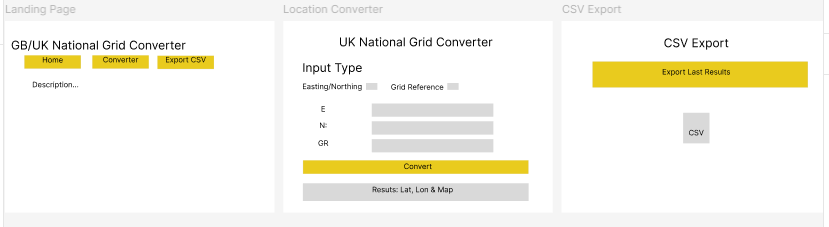

# Location_Converter
A Gradio application for converting UK National Grid coordinates, grid references and latitude/longitude.

---

## Agile Progress

### Sprint 1
- [x] Project setup
- [x] UI development

### Sprint 2
- [x] Coordinate conversion
- [x] Grid reference conversion

### Sprint 3
- [x] Map visualisation
- [x] CSV export

### Sprint 4
- [x] Testing
- [x] CI/CD
- [x] Documentation

## Stage 1 – Project Setup

### Objective: Establish the project structure and development environment.
### Tasks completed
- Created the GitHub repository “Location_Converter”.
- Added an initial README file.
- Created the first GitHub Project board and feature tickets (iterative).
- Set up the Python project structure for testing and guidance documentation and added to READ ME via pull request from project structure branch.
- Installed required dependencies.
- Outcome: A working project structure was created.

## Stage 2 – Coordinate Conversion and front-end build

### Objective: Implement the core functionality of the application.
### Tasks completed
- Develop app.py to build the shell of the application based on Figma design (from gradio_ui branch via pull request)
- Create converter.py in main branch using the pyproj package to enable coordinate conversion
- Developed a function to accept Easting and Northing values and convert to lat long via pull request from easting-to-latlong branch (utilises converter.py app.
- Developed a function to accept grid reference  values and convert to lat long via pull request from gridref-to-easting branch (utilises converter.py app.
- Developed a unified code version of full transformations and conversions to accept values and convert to lat long via pull request from  15-create-unified-conversion-function-for-coordinate-system-action-45
- Each pull request also lead to any wider code updates within each feature where necessary
- Added Folium map via the folium-map branch and updated app.py and converter.py code where necessary to enable the map visual
- Added csv export capabilities via the csv-export branch
- Outcome: The application could successfully convert coordinate values and display the results.

## Stage 3 – Test-Driven Development
### Objective: Verify the correctness of the conversion algorithm.
### Tasks completed
- Added validation and error testing to the app.py and converter.py via the validation-error-handling branch
- Created 5 unit tests in the codespace within the unit-testing branch; results were pulled to the main branch and shows the successful passing of all 5 unit tests against each function
- Ran GitHub Actions to ensure all automated tests pass; corrected error in tests.yaml to enable Actions to pass
- Outcome: The core functionality was validated through automated tests, ensuring reliable coordinate conversions.

## Stage 4 – Run application and manual testing
### Objective: Improve user interaction and ensure app functionality works.
### Tasks completed
- Run app within codespace to ensure it worked
- Error in code and therefore raised bug issue to correct code indentation; re-run the app in codespace
- Prompted users to enter Easting and Northing values.
- Displayed latitude and longitude in a clear format.
- Ensure CSV file exports
- Outcome: Users could interact with the application without modifying the source code.

## Stage 5 – Documentation
### Objective: Prepare the project for users and developers.
### Tasks completed
- Populate Technical Guide
- Populate User Guide
- Populate READ ME
- Outcome: The application is fully documented and can be easily installed, used, and maintained.

## Application Screenshot

## Evaluation

The UK National Grid Converter successfully achieves the objectives of the Minimum Viable Product (MVP) by allowing users to convert British National Grid coordinates into WGS84 latitude and longitude using either Easting/Northing values or Ordnance Survey Grid References. The application also provides an interactive map to visualise the converted location and allows results to be exported as a CSV file. Unit tests were implemented to verify the core conversion functions, increasing confidence in the application's reliability.

A key strength of the project is the separation of the conversion logic from the Gradio user interface, making the code easier to maintain and test. Input validation and error handling also improve usability by providing clear feedback when invalid data is entered.

However, the application has some limitations. It currently supports only the British National Grid coordinate system, and all input fields remain visible regardless of the selected conversion mode, which may reduce usability. Future work would include a dynamic interface that could display only the relevant inputs, support additional coordinate systems and allow batch conversion from CSV files. Overall, the project provides a functional and well-structured MVP that can be extended with additional features in future iterations.

